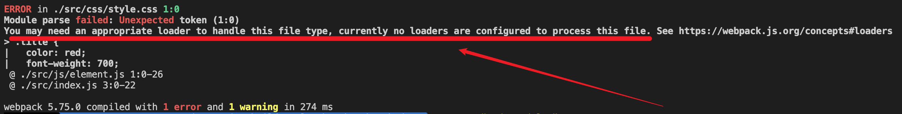
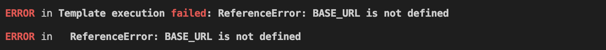

# 新手写给新手的webpack笔记

## webpack功能
在现代的前端项目中，我们常常需要进行模块化开发，对不同的模块进行资管打包管理，例如：我们想将ES6+的JS代码转换为ES5代码，将TS代码转换为JS代码，对CSS进行处理（Sass, Less），管理图像、字体资源，打包HTML文件和处理vue项目中的SFC文件(.vue)文件。

webpack则是处理这些问题的一把好手。

### 0. 下载
```shell
npm i webpack webpack-cli -D    // 局部安装
```
**webpack**

这个是工具本体

**webpack-cli**

这个是我们在用webpack这个工具时，一般都是借助命令行来运行，所以需要借助这个工具

### 1. 开始打包

**项目Demo初始化**

创建 webpack_demo 文件夹，然后命令行进入文件夹，执行如下命令，将项目包管理文件搞出来。
```powershell
npm --init -y
```

以下是项目目录下的文件夹
```powershell
.
├── package-lock.json
├── package.json
└── src（自己新建文件夹）
```

**以命令行的方式打包**

webpack 默认入口文件是 `src/index.js`，如果没有这个文件，且没有另外指定入口文件，就会出错，因此，我们创建`src/index.js`（目前里面没有任何内容）。
现在目录看起来是这样的：
```javascript
.
├── package-lock.json
├── package.json
└── src
    └── index.js
```
然后开始打包：
```js
// 我们可以直接在 webpack_demo 路径下直接执行 webpack
npx webpack    // webpack 会默认以 src/index.js 作为打包入口，然后生成一个 dist 打包文件目录，被打包的资源就放在这个里面

// 当然，你也可以通过命令行的方式指定入口等参数
npx webpack --entry ./src/main.js --output-path ./build
```

执行`npx webpack`后，现在目录看起来是这样的：
```powershell
.
├── dist
│   └── main.js
├── package-lock.json
├── package.json
└── src
    └── index.js
```

有一点经验的人就知道，我们可以像配置入口文件和出口路径一样配置大部分webpack配置（因为新手，不确定是不是全部配置），但是如果真的是这样的话，可以想象这是非常麻烦的，敲命令行手都敲断，而且也不方便其他同事。因此，我们就有了下面方式来打包。

**以配置文件的方式执行打包**

刚刚又说到，上面以命令行的方式打包不够灵活，如果需要指定的参数过多，就会非常麻烦，因此，一般都是写一个配置文件，配置文件名通常都是 `webpack.config.js` 。

新建这个文件后，现在目录看起来是这个样子：
```js
.
├── dist
│   └── main.js
├── package-lock.json
├── package.json
├── src
│   └── index.js
└── webpack.config.js
```

有了项目包管理文件后，就可以在`package.json`文件里配置脚本，省的每次都`npx webpack`，而且也规范些。

```js
// 在package.json 设置脚本，之后就可以用 npm run build 执行webpack打包了
"scripts": {
    "build": "webpack"    // 这里就是执行 webpack 命令，所以你当然也可以在 webpack后面添加一些命令参数，看起来如下：
    // "build_cmd": "webpack -entry ./src/main.js"    // 这样就改了webpack打包入口文件
}
```

下面开始配置webpack文件
```javascript
// webpack_demo/webpack.config.js

const path = require("path");

module.exports = {
	entry: "./src/index.js", // 指定打包入口
	output: {
		path: path.resolve(__dirname, "./dist"), // 指定打包文件夹
		filename: "bundle.js", //指定打包文件名
	},
};
```

为了能打包点东西，我们写点js的代码，目录如下：
```javascript
.
├── index.html
├── package-lock.json
├── package.json
├── src
│   ├── index.js
│   └── js
│       └── math.js
└── webpack.config.js

// src/js/math.js
export function sum(num1, num2) {
	return num1 + num2;
}

// src/index.js
import { sum } from "./js/math";

console.log(sum(10, 20));
```

然后执行`npm run build`打包，webpack会在执行过程中自动读取刚刚配置的文件。
```powershell
npm run build
```
现在目录看起来就是这个样子：
```javascript
.
├── dist
│   └── bundle.js
├── index.html    （新建）
├── package-lock.json
├── package.json
├── src
│   ├── index.js
│   └── js
│       └── math.js
└── webpack.config.js

// dis/bundle.js 内容
(()=>{"use strict";console.log(30)})();
```
代码打包好了之后，我们为了能看到效果，就在项目目录里新建了`index.html`元素，引入打包的`js`文件，`index.html`内容为：
```html
<!DOCTYPE html>
<html lang="en">
	<head>
		<meta charset="UTF-8" />
		<meta http-equiv="X-UA-Compatible" content="IE=edge" />
		<meta name="viewport" content="width=device-width, initial-scale=1.0" />
		<title>Document</title>
	</head>
	<body>
		<!-- <script src="./src/index.js" type="module"></script> -->
		<script src="./dist/bundle.js"></script>
	</body>
</html>
```
这样你就可以直接在浏览器打开这个文件，看到效果了；或者使用`Live Server`插件启动个服务来打开。

## 认识 loader

### 2. 打包CSS
**纯css**

为了能写一些css代码，我们写个js文件专门创建HTML元素，然后在这个文件中引入写的css文件，然后插入到HTML文档中。现在目录看起来是这个样子的：
```javascript
.
├── index.html
├── package-lock.json
├── package.json
├── src
│   ├── css
│   │   └── style.css    // 写css的文件
│   ├── index.js
│   └── js
│       ├── element.js    // 专门创建HTML元素，引入写的css文件
│       └── math.js
└── webpack.config.js

// src/js/element.js
import "../css/style.css";

const divEl = document.createElement("div");
divEl.className = "title";
divEl.innerHTML = "你好啊, steven~";

document.body.appendChild(divEl);

// src/css/style.css
.title {
  color: red;
  font-weight: 700;
  font-size: 30px;

  /* user-select: none; */
}
```

现在我们执行`npm run build`来开始打包，没有意外的话，会报如下错误：

仔细阅读报错信息，我们会发现需要个什么loader，这是我们第一次接触loader，所谓loader就是处理不同类型文件的，我们暂时可以这么理解。那有人问之前写的`.js`文件为什么不要对应loader？因为webpack天生认识`.js`文件，所以不需要，现在出现了`.css`文件，webpack暂时不认识，所以需要借助对应loader来认识。

此时，我们可以使用 `css-loader` 来让 webpack 认识，那就安装它吧：
```powershell
npm i css-loader -D
```
安装好了之后，还要在`webpack.config.js`里配置使用它，webpack才能认识`.css`文件，配置如下：
```javascript
const path = require("path"); // node 自带 path 模块，无需下载，这个包是为了方便拼接路径

module.exports = {
	entry: "./src/index.js", // 指定打包入口
	output: {
		path: path.resolve(__dirname, "./dist"), // 指定打包文件夹
		filename: "bundle.js", //指定打包文件名
	},
	module: {
		rules: [
			{
				test: /\.css$/,
				loader: "css-loader",
			},
		],
	},
};
```
然后开始重新打包，执行`npm run build`，打包成功，但是当你满心欢喜打开`index.html`文件时，发现样式并没有生效，这是为什么呢？因为`css-loader`只负责解析`.css`文件，并不负责将css插入页面中，这时候要用到另外一个loader，`style-loader`。

下载`style-loader`：
```powershell
npm i style-loader -D
```
在`webpack.config.js`中配置使用它：
```javascript
// 这里我们省略了相同的配置
...
rules: [
    {
        test: /\.css$/,
        // loader: "css-loader",
        use: ["style-loader", "css-loader"],
    },
],
...
```
重新打包`npm run build`，再打开`index.html`文件，发现样式已经生效了。

这里有两个点要补充，第一点是`rules`数组中每个item的写法以及更多配置，它总共有三种写法（注意，这里提前用了postcss-loader这个loader来说明第三种写法，后面马上就会说到）。见下方：
```javascript
rules: [
{
    test: /\.css$/,    // 正则表达式
    // 1. loader的写法 （语法糖）
    // loader: "css-loader",

    // 2. 完整的写法
    use: [
        // {loader: "css-loader"},
        "style-loader",
        "css-loader",    // 完整写法第二种

        "postcss-loader", // 使用了 postcss.config.js配置文件做了配置后的简写写法
        // 如果没有写 postcss.config.js 配置文件，完整写法。 注意，不管哪种，使用的 autoprefixer 插件要先下载，当然可以用更加强大的 postcss-preset-evn 插件
        // {
        //   loader: "postcss-loader",
        //   options: {
        //     postcssOptions: {
        //       plugins: [
        //         require("autoprefixer")
        //       ]
        //     }
        //   }
        // }
    ]
    }
]
```
第二点是一个item中`use`数组loader加载顺序，规则是`索引越大越先加载，即从后往前加载`。

**打包less文件**

对于`.less`文件，我们可以使用`less`这个工具来将它编译为`.css`文件，然后在按照打包纯css文件一样，处理它。

我们首先说用`less`工具对`.less`文件进行编译。

首先，安装`less`:
```javascript
npm i less -D
```
然后我们写个`.less`文件，现在目录结构和这个`.less`内容看起来是这样的：
```javascript
.
├── index.html
├── package-lock.json
├── package.json
├── src
│   ├── css
│   │   ├── style.css
│   │   └── title.less
│   ├── index.js
│   └── js
│       ├── element.js
│       └── math.js
└── webpack.config.js

// src/css/title.less
@bgColor: blue;
@textDecoration: underline;

.title {
  background-color: @bgColor;
  text-decoration: @textDecoration;
}
```
然后，我们用`less`工具对其进行编译转换为`.css`文件
```powershell
npx ./src/css/title.less ./src/css/title.less
```
就可以看到在对应目录下生成了转换后的`.css`文件了，但是在一个项目中，我们不可能手动一个一个去转，这时候我么可以借助`less-loader`这个loader自动帮我们转。

因此，先下载`less-loader`（注意，之前安装的`less`模块可卸载，不影响使用，刚刚只是为了演示转换这么个过程）：
```powershell
npm i less-loader -D
```
为了演示打包`.less`文件，`title.less`文件还要被引入，我们在之前的`element.js`中引入，所以现在`element.js`现在内容为：
```javascript
import "../css/style.css";
import "../css/title.less";    // 引入 .less 文件

const divEl = document.createElement("div");
divEl.className = "title";
divEl.innerHTML = "你好啊, steven~";

document.body.appendChild(divEl);
```
然后，在`webpack.config.js`中配置`less-loader`的使用，配置后这个文件内容如下：
```javascript
module: {
    rules: [
        {
            test: /\.css$/,
            use: ["style-loader", "css-loader"],
        },
        {
            test: /\.less/,    // 针对 less 文件的打包
            use: ["style-loader", "css-loader", "less-loader"],
        },
    ],
},
```

### 3. Postcss工具的使用
现在的浏览器众多，有时候我们需要为某些css属性增加前缀等功能，这时候可以利用这个工具来帮助我们自动的，统一的添加。

这个工具其实也是可以单独使用的，首先，我们下载它：
```powershell
npm i postcss postcss-cli -D
```
我们以css中`use-select`属性添加前缀为例，因此我们在之前的`style.css`文件中添加这个属性，所以这个文件现在内容如下：
```css
.title {
  color: red;
  font-weight: 700;
  font-size: 30px;

  user-select: none;
}
```
因为要添加前缀，所以，我们还需要安装添加前缀的插件`autoprefixer`：
```powershell
npm i autoprefixer -D
```
然后开始使用postcss这个工具：
```powershell
npx postcss --use autoprefixer -o ./src/css/transfer.css ./src/css/style.css
```
然后我们就看到转换后的文件对应属性自动添加了前缀。

如同`less`一样，在项目构建中，我们也不会直接使用命令行来一个个转换，也是利用对应loader即`postcss-loader`来自动帮我们进行转换。

因此，首先当然是下载啦：
```powershell
npm i postcss-loader -D
```
然后，和之前一样，也是配置`webpack.config.js`来使用它啦：
```javascript
// 注意，之前相同部分配置省略了
module: {
    rules: [
      {
        test: /\.css$/,    // 正则表达式
        // 1. loader的写法 （语法糖）
        // loader: "css-loader",

        // 2. 完整的写法
        use: [
          // {loader: "css-loader"},
          "style-loader",
          "css-loader",    // 完整写法第二种

          "postcss-loader", // 使用了 postcss.config.js配置文件做了配置后的简写写法
          // 如果没有写 postcss.config.js 配置文件，完整写法。 注意，不管那种，使用的 autoprefixer 插件要先下载，当然可以用更加强大的 postcss-preset-evn 插件
          // {
          //   loader: "postcss-loader",
          //   options: {
          //     postcssOptions: {
          //       plugins: [
          //         require("autoprefixer")
          //       ]
          //     }
          //   }
          // }
        ]
      },
      {
        test: /\.less$/,
        use: [
          "style-loader",
          "css-loader",
          "less-loader",
        ]
      }
    ]
  }
```

对于配置中提到的`postcss.config.js`与`postcss-preset-env`我们马上讲。

**postcss.config.js配置文件**
为了支持上面这个`webpack.config.js`中对postcss-loader的简写形式，我们在项目根目录新建一个`postcss.config.js`文件，其内容和现在项目目录结构如下：
```js
.
├── index.html
├── package-lock.json
├── package.json
├── postcss.config.js
├── src
│   ├── css
│   │   ├── style.css
│   │   ├── title.less
│   │   └── transfer.css
│   ├── index.js
│   └── js
│       ├── element.js
│       └── math.js
└── webpack.config.js

// postcss.config.js
module.exports = {
	plugins: [require("autoprefixer")],
};
```

**postcss-preset-env插件**

其实我们在使用`postcss-loader`的时候，使用`autoprefixer`这个插件还是太麻烦，而且对应现代css众多新特性，可能还需要其他插件来支持，这样要下更多的插件，配置也更多。而`postcss-preset-env`就为我们解决了这个问题，可以把它理解为为满足现代css新特性，而集合了许多类似`autoprefixer`这种插件的集合体。

首先，要用这个插件，那自然还是先下载啦：
```powershell
npm i postcss-preset-env -D
```
然后，在`postcss.config.js`文件中配置使用：
```javascript
module.exports = {
	plugins: [
		// require("autoprefixer"),
		require("postcss-preset-env"), // 也可以向下面这样，直接使用字符串
		// "postcss-preset-env",
	],
};
```

### 4. 打包其他资源
#### 打包图像

图像一般会在两个地方用到：元素的背景和img标签中使用，现在我们就用这两种方式来使用图片。为此，我们在原来的`element.js`中分别新建两个元素，一个是div，到时候使用图像作为它的背景，另外div元素需要设置一些样式，所以新建一个`image.css`来编写；另一个是img元素，到时候使用src属性为其设置图像资源。所以现在新增文件或新增的内容和目录结构如下：
```javascript
.
├── index.html
├── package-lock.json
├── package.json
├── postcss.config.js
├── src
│   ├── css
│   │   ├── image.css
│   │   ├── style.css
│   │   ├── title.less
│   │   └── transfer.css
│   ├── img                // 准备的图像资源
│   │   ├── nhlt.jpg
│   │   └── zznh.png
│   ├── index.js
│   └── js
│       ├── element.js
│       └── math.js
└── webpack.config.js

// src/element.js
// 之前相同内容省略了
import "../css/image.css";
import zznhImg from "../img/zznh.png";
// 图像资源作为背景进行显示
const bgDiv = document.createElement("div");
bgDiv.className = "image-bg";
document.body.appendChild(bgDiv);

// 图像资源作为img元素src属性进行显示
const imgEl = document.createElement("img");
imgEl.src = zznhImg;
document.body.appendChild(imgEl);

// src/css/image.css
.image-bg {
  width: 200px;
  height: 200px;
  display: inline-block;
  background-color: red;

  background-image: url("../img/nhlt.jpg");
  background-size: contain;
}
```

现在执行命令打包的话，可想而知，一定会出错，webpack不认识这些`.jpg .jpeg .png .svg .gif`的图片文件，所以我们使用`file-loader`来处理，那还是先下载啦：
```powershell
npm i file-loader -D
```

然后老规矩，配置`webpack.config.js`：
```javascript
module: {
    rules: [
        ...    // 相同的部分省略
        {
            test: /\.(jpe?g|png|gif|svg)$/,
            use: [{ loader: "file-loader" }],
        },
    ],
},
```

然后执行`npm run build`打包命令，就可以打包了，这里有个问题，就是为div设置背景的图像不显示。

#### 文件的命名规则
有时候我们希望处理后的文件名称按照一定规则来显式，这时候可以用webpack提供的`PlaceHolders`。
这些可以在 https://webpack.js.org/loaders/file-loader/ 查询

**设置文件名称**
修改`webpack.config.js`配置文件
```javascript
module: {
    rules: [
        ...    // 相同的部分省略
        {
            test: /\.(jpe?g|png|gif|svg)$/,
            use: [
                {
                    loader: "file-loader",
                    options: {
                        name: "img/[name].[hash:8].[ext]",
                        // outputPath: "img", // 当然，我们可以单独设置这个图像文件目录，那上面这行的name属性中"img/"就不需要写了
                    },
                },
            ],
        },
    ],
},
```
像`[name] [hash:8] [ext]`这类的就是PlaceHolder，现在执行打包命令，就可以看见资源都按照预定的格式名打包了。

#### url-loader的使用
url-loader同样可以对图片资源进行打包，而且还能通过设置参数将较小的文件转成`base64或URI`。
要用它同样还是先安装：
```powershell
npm i url-loader -D
```
然后在`webpack.config.js`中配置使用，注意，这里先注释file-loader的配置，防止相互影响。
```javascript
// {
// 	test: /\.(jpeg|jpg|png|gif|svg)$/,
// 	use: [
// 		{
// 			loader: "file-loader",
// 			options: {
// 				name: "img/[name].[hash:8].[ext]",
// 				// outputPath: "img", // 当然，我们可以单独设置这个图像文件目录，那上面这行的name属性中"img/"就不需要写了
// 			},
// 		},
// 	],
// },
{
    test: /\.(jpeg|jpg|png|gif|svg)$/,
    use: [
        {
            loader: "url-loader",
            options: {
                limit: 100 * 1024,    // 单位为 byte，这是设置即为小于 100kb 的资源才转为 base64
                name: "[name].[hash:8].[ext]",
                outputPath: "img",
            },
        },
    ],
},
```
默认情况下，`url-loader`会将所有图片资源转成base64的，这时候我们可以用它的`limit`属性来配置，规定小于多少的才转为base64。

#### 使用 asset module type 提供一揽子资源解决方案
在webpack5之前，都需要使用不同的loader来处理资源，例如`raw-loader, url-loader, file-loader`，但在webpack5之后，就不需要啦，只需要使用 `asset module type (资源模块类型)`，就可以代替上面这些loader。

`asset module type`共有4中模块类型：
- asset/resource: 等价于 file-loader
- asset/inline: 等价于 url-loader
- asset/source: 等价于 raw-loader
- asset: 类似在file-loader和url-loader之间自动选择，可以配置资源体积限制来设置是否转为base64

**加载图片资源为例**

这里就不需要像用其他loader一样下载其他东西了，直接用，所以直接配置`webpack.config.js`文件，注意，之前对图片资源处理的两个配置需要注释掉。同时，为打包文件配置输出路径，下面提供了两种写法注意“【方法一、二】”的位置及其对应的属性。这里给出了完整的配置文件。
```js
const path = require("path"); // node 自带 path 模块，无需下载，这个包是为了方便拼接路径

module.exports = {
	entry: "./src/index.js", // 指定打包入口
	output: {
		path: path.resolve(__dirname, "./dist"), // 指定打包文件夹
		filename: "bundle.js", //指定打包文件名
		// 使用 asset module type 为打包文件配置输出路径 【方法一】
		// assetModuleFilename: "img/[name].[hash:6][ext]",
	},
	module: {
		rules: [
			{
				test: /\.css$/,
				// loader: "css-loader",
				use: ["style-loader", "css-loader", "postcss-loader"],
			},
			{
				test: /\.less/,
				use: ["style-loader", "css-loader", "less-loader"],
			},
			// {
			// 	test: /\.(jpeg|jpg|png|gif|svg)$/,
			// 	use: [
			// 		{
			// 			loader: "file-loader",
			// 			options: {
			// 				name: "img/[name].[hash:8].[ext]",
			// 				// outputPath: "img", // 当然，我们可以单独设置这个图像文件目录，那上面这行的name属性中"img/"就不需要写了
			// 			},
			// 		},
			// 	],
			// },
			// {
			// 	test: /\.(jpeg|jpg|png|gif|svg)$/,
			// 	use: [
			// 		{
			// 			loader: "url-loader",
			// 			options: {
			// 				limit: 100 * 1024,
			// 				name: "img/[name].[hash:8].[ext]",
			// 				// outputPath: "img", // 当然，我们可以单独设置这个图像文件目录，那上面这行的name属性中"img/"就不需要写了
			// 			},
			// 		},
			// 	],
			// },
			{
				test: /\.(jpe?g|png|gif|svg)$/,
				type: "asset/resource",
				// 使用 asset module type 为打包文件配置输出路径 【方法二】
				generator: {
					filename: "img/[name].[hash:6][ext]", // 注意，这里[ext]已经包括了 . 了，所以不用像之前 url-loader一样 .[ext]
				},
			},
		],
	},
};
```
**使用asset获得url-loader的limit功能**
修改配置`webpack.config.js`文件
```js
// 相同内容已省略
{
    test: /\.(jpe?g|png|gif|svg)$/,
    type: "asset",    // 改为了 asset
    generator: {
        filename: "img/[name].[hash:6][ext]", 
    },
    // 新增这个设置属性
    parser: {
        dataUrlCondition: {
            maxSize: 100 * 1024,    // 和之前一样，单位为 byte。现在这样设置也是小于100kb的资源对其进行 base64 编码。
        },
    },
},
```
现在使用`npm run build`打包，就可以对小文件资源进行base64编码，对大文件资源按路径设置进行打包。使用这种方式打包图片资源，对于上述使用file-loader打包出现的div设置背景的图像不显示问题，就解决了。之前的方式应该也有自己的解决方式，但是目前我没找。

### 5. 打包字体文件
这部分主要是处理项目中的字体或者字体图标。

为了能做这个测试，我们先引入字体文件，然后在`element.js`中创建一个`i`元素来使用字体图标，然后对其进行打包。引入字体后，现在的项目目录看起来是这个样子的。
```js
.
├── index.html
├── package-lock.json
├── package.json
├── postcss.config.js
├── src
│   ├── css
│   │   ├── image.css
│   │   ├── style.css
│   │   ├── title.less
│   │   └── transfer.css
│   ├── font    (字体目录)
│   │   ├── iconfont.css
│   │   ├── iconfont.eot
│   │   ├── iconfont.ttf
│   │   ├── iconfont.woff
│   │   └── iconfont.woff2
│   ├── img
│   │   ├── nhlt.jpg
│   │   └── zznh.png
│   ├── index.js
│   └── js
│       ├── element.js
│       └── math.js
└── webpack.config.js

// src/js/element.js
// 相同内容省略
import "../font/iconfont.css"; // 引入字体样式
// 字体资源
const iEl = document.createElement("i");
iEl.className = "iconfont icon-ashbin";
```

这时，我们会想，要用什么loader来打包呢？其实之前的`file-loader`就可以，但是刚刚讲了`asset module type`，我们可以直接用这个。

修改`webpack.config.js`配置文件，对字体文件进行打包：
```javascript
// 相同内容已省略
{
    test: /\.(woff2?|eot|ttf)/,
    type: "asset/resource",
    generator: {
        filename: "font/[name].[hash:6][ext]",
    },
},
```

## 认识 Plugin
对比于之前的`Loader`是对特定的模块类型资源进行转换，而`plugin`则是可以执行更加广泛的任务，例如打包优化，资源管理，环境变量注入等。

我理解就类似Vue种的生命周期钩子，在组件的不同期间为你调不同钩子函数，而`webpack`种的`Plugin`也有这种感觉，就是在webpack为你打包的过程中，在不同时期使用你配置的plugin插件。

### 一些常用插件

#### 1. CleanWebpackPlugin
之前我们每次打包前都需要自己手动删除上一次打包的`dist`目录，现在我们就可以利用这个plugin来自动帮助我们做这个事。

首先，仍然是先安装：
```powershell
npm i clean-webpack-plugin -D
```

然后在`webpack.config.js`中配置使用插件：
```javascript
const path = require("path"); // node 自带 path 模块，无需下载，这个包是为了方便拼接路径

const { CleanWebpackPlugin } = require("clean-webpack-plugin"); // 导入插件【步骤一】

module.exports = {
	entry: "./src/index.js", // 指定打包入口
	output: {
		path: path.resolve(__dirname, "./dist"), // 指定打包文件夹
		filename: "bundle.js", //指定打包文件名
		// 使用 asset module type 为打包文件配置输出路径 【方法一】
		// assetModuleFilename: "img/[name].[hash:6][ext]",
	},
    module: {...}    // 这部分配置省略！！！
	plugins: [new CleanWebpackPlugin()],    // 使用插件【步骤一】
};
```
后面再执行`npm run build`的时候，就无需自己再手动先删除`dist`文件夹了。

#### 2. HtmlWebpackPlugin
之前我们打的包里都不包括`index.html`这个入口文件，之前使用也是在`src`下新建这个文件，然后再自己手动通过`<script src="./dist/bundle.js"></script>`引入打包的文件，这是不规范的；而且在项目部署的时候，也是需要这个`index.html`这个文件的，所以我们可以用`HtmlWebpackPlugin`插件来对这个HTML文件打包。

首先，安装：
```powershell
npm i html-webpack-plugin -D
```

然后在`webpack.config.js`中配置使用插件：
```javascript
const path = require("path"); // node 自带 path 模块，无需下载，这个包是为了方便拼接路径

const { CleanWebpackPlugin } = require("clean-webpack-plugin");
const HtmlWebpackPlugin = require("html-webpack-plugin");

module.exports = {
	entry: "./src/index.js", // 指定打包入口
	output: {
		path: path.resolve(__dirname, "./dist"), // 指定打包文件夹
		filename: "bundle.js", //指定打包文件名
		// 使用 asset module type 为打包文件配置输出路径 【方法一】
		// assetModuleFilename: "img/[name].[hash:6][ext]",
	},
    module: {...}    // 这部分配置省略！！！
	plugins: [new CleanWebpackPlugin(), new HtmlWebpackPlugin()],
};
```

最后执行`npm run build`命令打包，然后我们就可以在`dist`目录下看到`index.html`这个文件了，打开文件可以看到它自动引入了`bundle.js`文件。

那现在就有个问题，打包里的`dist/index.html`文件在哪里来的？它和我们自己编写的`index.html`有关系吗？

打包里的`index.html`是`HtmlWebpackPlugin`这个插件通过`ejs模版`生成的，在`html-webpack-plugin`的源码里有个`default_index.html`文件。

打包里的`dist/index.html`与`index.html`暂时没有关系，但是接下来我们可以让他们有关系。

**自定义打包文件里的index.html文件**

有时候我们可能需要在打包好的`dist/index.html`文件里包行我们自己想要添加的元素，例如`Vue`里的`<div id="app"><div>`，或者一些其他的内容，如果在打包后之后，自己再手动一遍一遍的写肯定不现实，因此我们可以先定义自己的`index.html`模版，然后在这个插件里通过配置，让其加载我们的模版，这样，就自定义了打包文件里`index.html`内容了。

一般我们把自己定义的`index.html`文件放到项目目录下的`public`目录中，所以现在目录结构看起来如下：
```javascript
.
├── index.html
├── package-lock.json
├── package.json
├── postcss.config.js
├── public
│   ├── favicon.ico    (一张图片)
│   └── index.html    (我们自己定义的index.html)
├── src
│   ├── css
│   │   ├── image.css
│   │   ├── style.css
│   │   ├── title.less
│   │   └── transfer.css
│   ├── font
│   │   ├── iconfont.css
│   │   ├── iconfont.eot
│   │   ├── iconfont.ttf
│   │   ├── iconfont.woff
│   │   └── iconfont.woff2
│   ├── img
│   │   ├── nhlt.jpg
│   │   └── zznh.png
│   ├── index.js
│   └── js
│       ├── element.js
│       └── math.js
└── webpack.config.js

// index.html
<!DOCTYPE html>
<html lang="">
	<head>
		<meta charset="utf-8" />
		<meta http-equiv="X-UA-Compatible" content="IE=edge" />
		<meta name="viewport" content="width=device-width,initial-scale=1.0" />
		<link rel="icon" href="<%= BASE_URL %>favicon.ico" />
		<title><%= htmlWebpackPlugin.options.title %></title>
	</head>
	<body>
		<noscript>
			<strong
				>We're sorry but <%= htmlWebpackPlugin.options.title %> doesn't work
				properly without JavaScript enabled. Please enable it to
				continue.</strong
			>
		</noscript>
		<div id="app"></div>
		<!-- built files will be auto injected -->
	</body>
</html>
```

在上面这个自定义的`index.html`文件里，我们看到许多`<%= ... %>`这样的语法，这是`EJS模块填充数据`的方式。

我们接着配置`webpack.config.js`文件：
```js
// 相同的地方已省略
plugins: [
    new CleanWebpackPlugin(),
    new HtmlWebpackPlugin({
        template: "./public/index.html",    // 指定模板文件
        title: "哈哈哈哈",    // 此时模版中 htmlWebpackPlugin.options.title 就会读这个值
    }),
],
```
然后我们执行打包命令`npm run build`，发现如下报错：

很明显，`public/index.html`中有个`BASE_URL`没有定义，那这个怎么定义呢？我们要用到下一个插件。

#### 3. DefinePlugin
`DefinePlugin`这个插件允许我们在打包编译时穿件环境变量，它是Webpack的内置插件，无需下载。

那么，我们继续配置`webpack.config.js`文件。
```javascript
const { DefinePlugin } = require("webpack");

// 注意，之前相同的配置已经省略
plugins: [
    new CleanWebpackPlugin(),
    new HtmlWebpackPlugin({
        template: "./public/index.html", // 指定模板文件
        title: "哈哈哈哈",
    }),
    new DefinePlugin({
        BASE_URL: '"./"', // 注意这里的写法，他会原封不动的把内容赋到要用的地方，因此这里是'"./"'
    }),
],
```
然后执行打包命令`npm run build`就可以打包了，打包好了之后，我们查看`dist/index.html`文件内容，之前的EJS模版就全部被替换了：
```html
<!DOCTYPE html>
<html lang="">
	<head>
		<meta charset="utf-8" />
		<meta http-equiv="X-UA-Compatible" content="IE=edge" />
		<meta name="viewport" content="width=device-width,initial-scale=1" />
		<link rel="icon" href="./favicon.ico" />
		<title>哈哈哈哈</title>
		<script defer="defer" src="bundle.js"></script>
	</head>
	<body>
		<noscript><strong>We're sorry but 哈哈哈哈 doesn't work properly without JavaScript enabled. Please enable it to continue.</strong></noscript>
		<div id="app"></div>
	</body>
</html>
```
但是当我们打开`dist/index.html`文件是，发现浏览器标签并没有出现我们指定的小图标，二其他内容都生效了，这是因为`public/favicon.ico`文件在打包的时候并没有一起复制过去。我们可以用下面这个插件来解决。

#### 4. CopyWebpackPlugin
使用这个插件后，我们如果把一些文件放到`public`目录下（应该是默认的），就会将这个目录下的文件复制到`dist`下。

首先，还是先下载这个插件：
```powershell
npm i copy-webpack-plugin -D
```

然后，配置`webpack.config.js`：
```javascript
const CopyWebpackPlugin = require("copy-webpack-plugin");

// 注意，之前的配置有省略
plugins: [
    new CleanWebpackPlugin(),
    new HtmlWebpackPlugin({
        template: "./public/index.html", // 指定模板文件
        title: "哈哈哈哈",
    }),
    new DefinePlugin({
        BASE_URL: '"./"', // 注意这里的写法，他会原封不动的把内容赋到要用的地方，因此这里是'"./"'
    }),
    new CopyWebpackPlugin({
        patterns: [
            {
                from: "public", // 设置从哪个源（目录）下开始复制
                // to: "./", // 复制到哪个目录下，注意这里是相对于打包后 dist下的路径，其实这里可以不配置
                globOptions: {
                    // 一些额外的选项，其中可以编写需要忽略的文件，因为我们借助HtmlWebpackPlugin生成了 dist/index.html文件，所以 public/index.html这个文件不需要复制
                    ignore: ["**/.DS_Store", "**/index.html"],
                },
            },
        ],
    }),
],
```

## 其他属性
### mode
`mode`这个属性可以告诉webpack目前所述打包模式，其值有`none|production|development(默认值)`，选择不同值，其实会对应一堆优化配置。

配置`webpack.config.js`
```javascript
...
module.exports = {
	// 设置模式
	// development 开发阶段, 会设置development
	// production 准备打包上线的时候, 设置production
	mode: "development",
    ...
}
```

### devtool
这个属性主要和打包后调试有关，设置打包代码如何与源代码映射关系，一般取值为`source-map`
```javascript
module.exports = {
	// 设置source-map, 建立js映射文件, 方便调试代码和错误
    devtool: "source-map",
}
```

## Babel工具
`Babel`可以将ES6+的js代码转换为ES5的代码转换工具，它是一个独立的工具，可以像postcss一样独立使用。

首先，安装Babel：
```powershell
npm i @babel/core @babel/cli -D
```
### 单独使用Babel
为了单独使用Babel，新建`src/babel_demo/demo.js`文件，并且写一些ES6+代码：
```javascript
// src/babel_demo/demo.js
const message = "Hello World";
const names = ["abc", "cba", "nba"];

names.forEach((item) => console.log(item));
```
然后使用babel命令执行：
```powershell
npx babel src/babel_demo --out-dir src/babel_demo/transfer
```

查看`src/babel_demo/transfer/demo.js`，似乎变化不大，这是因为babel针对不同的功能转换，任然需要使用不同的babel配置插件，例如我想将`src/babel_demo/demo.js`中的箭头函数转换为普通函数定义，将`const`转换为`var`就分别要用到`@babel/plugin-transform-arrow-functions`，`@babel/plugin-transform-block-scoping`这两个插件。

好，那现在就下载这两个插件：
```powershell
npm i @babel/plugin-transform-arrow-functions @babel/plugin-transform-block-scoping -D
```
然后再删除`src/babel_demo/transfer`文件目录，然后重新执行babel如下命令：
```powershell
npx babel src/babel_demo --out-dir src/babel_demo/transfer --plugins=@babel/plugin-transform-arrow-functions,@babel/plugin-transform-block-scoping
```
这样，再看`src/babel_demo/transfer/demo.js`里的内容，就转换成功了。

但是，如果要转换的功能很多，如果照上面配置，是很麻烦的，因此我们可以使用预设`@babel/preset-env`，先下载：
```powershell
npm i @babel/preset-env -D
```
然后使用这个预设来转换，先删除`src/babel_demo/transfer`文件目录，再执行命令：
```powershell
npx babel src/babel_demo --out-dir src/babel_demo/transfer --presets=@babel/preset-env
```

### 在构建工具中使用Babel
通常，我们会在构建工具中使用Babel，如现在的webpack，因此需要下载对应依赖。

需要下载`babel-loader`和`@babel/core`这两个，如果后面这个刚刚下载了，就不需要再重复下载了。
```powershell
npm i babel-loader @babel/core -D
```

然后在`webpack.config.js`配置使用：
```javascript
module: {
    rules: [
        {
            test: /\.m?js$/,
            use: [
                {
                    loader: "babel-loader",
                    options: {
                        plugins: [
                            "@babel/plugin-transform-arrow-functions",
                            "@babel/plugin-transform-block-scoping",
                        ],
                    },
                },
            ],
        },
        ...
    ]
...
}
```
如果一个个再去安装babel的插件，是非常麻烦的，因此，我们可以使用`@babel/preset-env`。

首先下载：
```powershell
npm i @babel/preset-env -D
```

然后配置`webpack.config.js`使用：
```javascript
module: {
    rules: [
        {
            test: /\.m?js$/,
            use: [
                {
                    loader: "babel-loader",
                    options: {
                        // plugins: [
                        //     "@babel/plugin-transform-arrow-functions",
                        //     "@babel/plugin-transform-block-scoping",
                        // ],
                        presets: ["@babel/preset-env"],
                    },
                },
            ],
        },
        ...
    ]
...
}
```

我们也可以在项目根目录下新建`babel.config.js`来将Babel的配置项放到一个文件中。
```js
module.exports = {
	presets: ["@babel/preset-env"],
};
```

然后`webpack.config.js`就可以触发loader的简写了。
```javascript
module: {
    rules: [
        {
            test: /\.m?js$/,
            loader: "babel-loader",
            // use: [
            //     {
            //         // options: {
            //         //     // plugins: [
            //         //     //     "@babel/plugin-transform-arrow-functions",
            //         //     //     "@babel/plugin-transform-block-scoping",
            //         //     // ],
            //         //     presets: ["@babel/preset-env"],
            //         // },
            //     },
            // ],
        },
        ...
    ]
...
}
```

## 打包Vue文件
为了打包vue文件，我们先将.vue文件准备好，现在整个项目目录如下：
```javascript
.
├── babel.config.js
├── index.html
├── package-lock.json
├── package.json
├── postcss.config.js
├── public
│   ├── favicon.ico
│   └── index.html
├── src
│   ├── babel_demo
│   │   ├── demo.js
│   │   └── transfer
│   │       └── demo.js
│   ├── css
│   │   ├── image.css
│   │   ├── style.css
│   │   ├── title.less
│   │   └── transfer.css
│   ├── font
│   │   ├── iconfont.css
│   │   ├── iconfont.eot
│   │   ├── iconfont.ttf
│   │   ├── iconfont.woff
│   │   └── iconfont.woff2
│   ├── img
│   │   ├── nhlt.jpg
│   │   └── zznh.png
│   ├── index.js
│   ├── js
│   │   ├── element.js
│   │   └── math.js
│   └── vue                (存放.vue文件的目录)
│       ├── HelloWorld.vue (新建的.vue组件)
│       └── app.vue    (vue 的根组件)
└── webpack.config.js
```
`src/vue/app.vue`文件内容如下：
```js
<template>
	<h2>我是Vue渲染出来的</h2>
	<h2>{{ title }}</h2>
	<hello-world></hello-world>
</template>

<script>
import HelloWorld from "./HelloWorld.vue";

export default {
	components: {
		HelloWorld,
	},
	data() {
		return {
			title: "Hello World",
			message: "哈哈哈",
		};
	},
	methods: {},
};
</script>

<style scoped>
h2 {
	color: red;
}
</style>
```
`src/vue/HelloWorld.vue`文件内容如下：
```javascript
<template>
	<h2>Hello World组件</h2>
</template>

<script>
export default {
	data() {
		return {};
	},
};
</script>

<style></style>
```

**开始打包**

既然用到了Vue，那Vue是要下载的，注意这是线上依赖：
```powershell
npm i vue -S
```

然后执行打包`npm run build`，报错，和之前一样，现在项目里引入了`.vue`文件，所以需要新的loader来处理，这个loder是`vue-loader`，下载：
```powershell
npm i vue-loader -D
```

再配置`webpack.config.js`使用：
```js
// 省略了相同内容
module:{
    rules: [
        {
            test: /\.vue$/,
            loader: "vue-loader",
        },
    ]
}
```

然后再执行，发现还是报错，因为我们还要对`<template>`进行解析，所以还需要一个插件，`@vue/compiler-sfc`，先下载：
```powershell
npm i @vue/compiler-sfc -S
```
再配置`webpack.config.js`使用：
```javascript
// 配置打包vue文件的插件
const { VueLoaderPlugin } = require("vue-loader");

// 相同配置部分省略
plugins: [
    ...
    new VueLoaderPlugin()
]
```

现在再执行打包`npm run build`，打包终于成功了！！！然后打开`dist/index.html`，就能看到使用Vue渲染的内容了。

## webpack dev server
我们希望能有一个好的开发体验，而不是像之前一样，手动打开`dist/index.html`，或者使用vscode的`Live Server`插件来帮助我们，另外即使使用了`Live Server`插件后，刷新时是整个页面刷新的，这样开销比较大，我们希望能做到只改动某个模块（组件）时，刷新这个组件，即热模块替换。这些都可以使用`webpack-dev-server`这个插件来实现。

首先，还是安装：
```powershell
npm i webpack-dev-server -D
```

然后再在`package.json`增加一行脚本：
```javascript
// 相同内容已省略
"scripts": {
    ...
    "dev": "webpack serve"
},
```

然后再配置`webpack.config.js`来使用它：
```js
module.exports = {
    target: "web",
    devServer: {
		// contentBase: "./dist",
		static: path.resolve(__dirname, "./public"), // contentBase 这个属性不在使用了
		// compress: true, // 是否开启 gzip 压缩!!! 打包上线时很有用，能将资源打包为gzip压缩包
		open: true,
		port: 8000,
        hot: true, // 开启热模块替换 HMR，vue-loader是支持HMR的，直接开箱即用，无需其他配置了。
	},
}
```
然后执行`npm run dev`即可启动服务了，其他一些关于devServer属性的配置可以参考官网，例如proxy属性。

